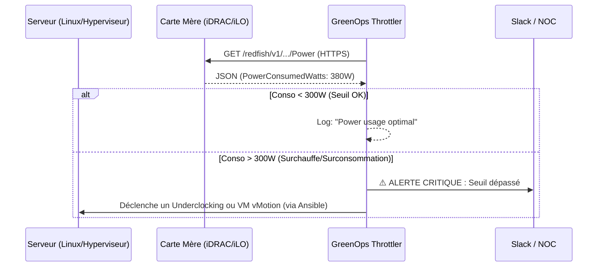

# GreenOps Power Throttler

L'optimisation énergétique n'est plus une option. Ce script SRE va taper directement dans l'API RESTful (Redfish) des cartes de management (iDRAC pour Dell, iLO pour HPE) pour récupérer la consommation électrique physique des serveurs en temps réel.

Si un serveur dépasse son enveloppe thermique ou de consommation (TDP/Watts), le script déclenche une alerte et peut être couplé à un hyperviseur pour forcer un mode d'économie d'énergie ou migrer des VMs (DRS).

##  Architecture du Script



# Fonctionnalités
Surveillance bare-metal via le standard industriel Redfish.

Ignore intelligemment les erreurs de certificats auto-signés (typique sur les IP de management internes).

Base solide pour automatiser l'extinction de ports ou la limitation CPU (Power Capping).

# Installation
```Bash
git clone https://github.com/FilouCosmos/greenops-power-throttler.git
cd greenops-power-throttler
pip install -r requirements.txt
```

# Configuration & Utilisation
Éditez les variables REDFISH_URL, et AUTH dans green_throttler.py avec l'IP et les identifiants de votre interface de management.

Définissez votre seuil d'alerte dans MAX_WATTS.

Lancez le script :

```Bash
python3 green_throttler.py
```

# Automatisation (Cron)
Pour avoir un vrai suivi énergétique, faites tourner ce check toutes les 15 minutes. Éditez votre crontab (crontab -e) :

```Bash
*/15 * * * * /usr/bin/python3 /chemin/vers/greenops-power-throttler/green_throttler.py >> /v
```
